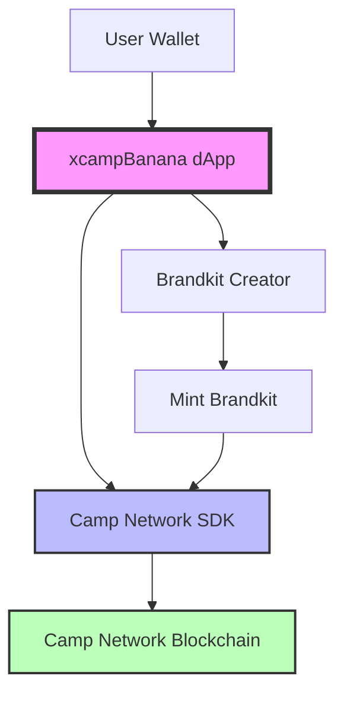
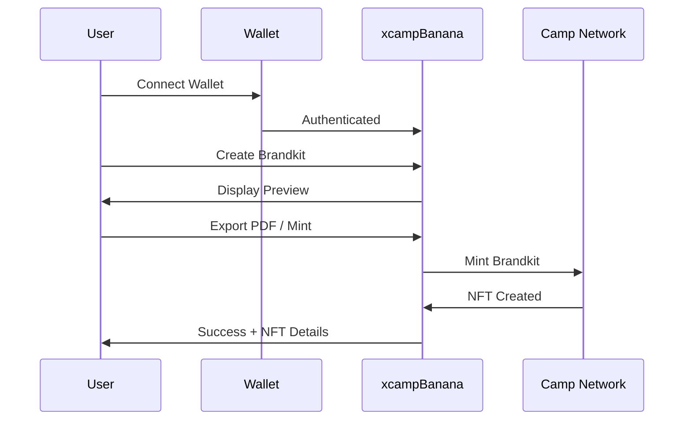

<div align="center">
  
  <h1>xcampBanana</h1>
  <p><strong>Monetize your Content on Camp Network</strong></p>
</div>

---

## About

Decentralized app for content creators to monetize work on Camp Network. Create and sell Nanabanapro Brandkit prompts.

## Architecture



## Quick Start

```bash
# Install
npm install

# Dev
npm run dev

# Build
npm run build
```

## Features

- Brandkit Creation & Sales
- PDF Export & Upload
- Custom Royalties
- AI Assistant
- Camp Network Powered

## Tech Stack

- Next.js 15
- Tailwind CSS 4
- Camp Network Origin SDK
- TanStack React Query
- TypeScript

## Project Structure

```
xcamp/
├── app/
│   ├── components/
│   │   └── BrandkitMint.tsx
│   ├── layout.tsx
│   ├── page.tsx
│   └── providers.tsx
└── public/
    └── nano.jpeg
```

## Workflow


---

<div align="center">
  Built with ❤️ using Camp Network
</div>
